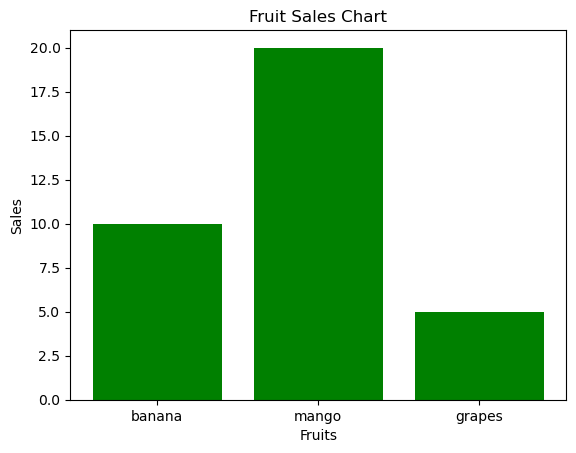
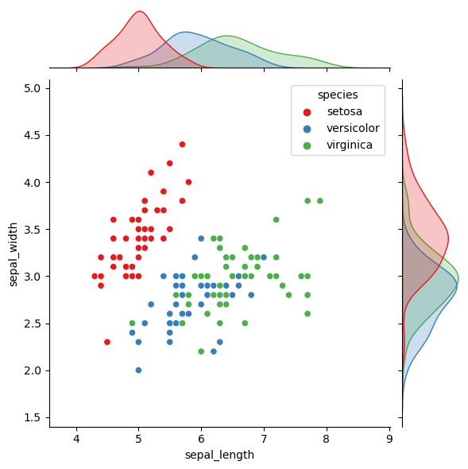

```python
from matplotlib import pyplot as plt
# plt.bar(["banana","mango","grapes"],[10,20,5])
# plt.show()

plt.bar(["banana","mango","grapes"],[10,20,5], color="green")
plt.xlabel("Fruits")
plt.ylabel("Sales")
plt.title("Fruit Sales Chart")
plt.show()

# plt.pie([100, 230, 450], labels=["audi", "tata", "thar"])
# plt.show()
```


    

    


```python
from matplotlib import pyplot as plt
x_values = [1,2,3,4,5]
y_values = [2.0, 2.3, 3.4, 1.3, 4.5]
plt.plot(x_values, y_values, marker='o', color='green', linestyle='--', linewidth=2, markersize=12)
plt.xlabel("X-Axis")
plt.ylabel("Y-Axis")
plt.title("Line Chart")
plt.show()
# print(help(plt.plot))
```


    

    


```python
# Step 1: Import Libraries
import numpy as np
import pandas as pd
import matplotlib.pyplot as plt
from sklearn.model_selection import train_test_split
from sklearn.linear_model import LinearRegression
from sklearn.metrics import r2_score

# Step 2: Load Dataset
dataset = pd.read_csv('C:\\Users\\aakash\\Downloads\\Salary_Data.csv') # Load CSV file

print(dataset.head()) # Display first 5 rows

# Step 3: Extract Features (X) and Target (y)
X = dataset.iloc[:, :-1].values # Selecting 'Years of Experience'
y = dataset.iloc[:, -1].values # Selecting 'Salary'

# Step 4: Split Data into Training and Testing Sets
X_train, X_test, y_train, y_test = train_test_split(X, y, test_size=1/3, random_state=0)

# Step 5: Train the Simple Linear Regression Model
regressor = LinearRegression() # Create model
regressor.fit(X_train, y_train) # Train model on training data

# Step 6: Make Predictions
y_pred = regressor.predict(X_test) # Predict salaries for test data

# Step 7: Visualizing the Training Set
plt.scatter(X_train, y_train, color='red') # Plot actual data points
plt.plot(X_train, regressor.predict(X_train), color='blue') # Regression line
plt.title("Salary vs Experience (Training Set)")
plt.xlabel("Years of Experience")
plt.ylabel("Salary")
plt.show()

# Step 8: Visualizing the Test Set
plt.scatter(X_test, y_test, color='red') # Plot actual test points
plt.plot(X_train, regressor.predict(X_train), color='blue') # Regression line
plt.title("Salary vs Experience (Test Set)")
plt.xlabel("Years of Experience")
plt.ylabel("Salary")
plt.show()

# Step 9: Evaluate Model Performance
r_squared = r2_score(y_test, y_pred) # Compute R-squared score
print("R-squared Score:", r_squared) # Print model accuracy

# Predict salary for 16.7 years of experience
experience = np.array([[16.7]]) # Input as 2D array
predicted_salary = regressor.predict(experience)[0] # Predict salary

predicted_salary
```

       YearsExperience   Salary
    0              1.1  39343.0
    1              1.3  46205.0
    2              1.5  37731.0
    3              2.0  43525.0
    4              2.2  39891.0
    


    

    


    

    


    R-squared Score: 0.9749154407708353
    


    182893.43104417477


```python
import pandas as pd
import itertools

transactions = [
    ["Milk", "Bread", "Butter"],
    ["Bread", "Butter"],
    ["Milk", "Bread", "Butter", "Eggs"],
    ["Bread", "Eggs"],
    ["Milk", "Eggs"],
    ["Milk", "Bread", "Butter"],
    ["Milk", "Bread"],
]

# Create a set of all unique items
items = sorted(set(item for transaction in transactions for item in transaction))

# Function to compute support
def get_support(itemset, transactions):
    count = sum(1 for transaction in transactions if itemset.issubset(transaction))
    return count / len(transactions)

# Generate frequent itemsets using Apriori
def apriori(transactions, min_support):
    itemsets = [{item} for item in items]  # Initial single-item sets
    frequent_itemsets = {}

    while itemsets:
        # Calculate support for each itemset
        itemset_support = {
            frozenset(itemset): get_support(set(itemset), transactions)
            for itemset in itemsets
        }

        # Filter by min support
        itemset_support = {
            k: v for k, v in itemset_support.items() if v >= min_support
        }
        frequent_itemsets.update(itemset_support)

        # Generate new candidate itemsets (combine pairs)
        new_itemsets = set()
        itemsets_list = list(itemset_support.keys())

        for i in range(len(itemsets_list)):
            for j in range(i + 1, len(itemsets_list)):
                new_candidate = itemsets_list[i] | itemsets_list[j]  # Union of two itemsets
                if len(new_candidate) == len(itemsets_list[i]) + 1:
                    new_itemsets.add(new_candidate)

        itemsets = list(new_itemsets)

    return frequent_itemsets

# Function to generate association rules
def generate_rules(frequent_itemsets, min_confidence):
    rules = []

    for itemset, support in frequent_itemsets.items():
        if len(itemset) > 1:
            for i in range(1, len(itemset)):  # Generate all subsets
                for X in itertools.combinations(itemset, i):
                    X = frozenset(X)
                    Y = itemset - X

                    if X in frequent_itemsets and frequent_itemsets[X] > 0:
                        confidence = support / frequent_itemsets[X]
                        Y_support = frequent_itemsets.get(Y, 1)  # Avoid division by zero
                        lift = confidence / Y_support

                        if confidence >= min_confidence:
                            rules.append((X, Y, support, confidence, lift))

    return rules

# Set minimum support and confidence thresholds
min_support = 0.3
min_confidence = 0.5

# Run Apriori algorithm
frequent_itemsets = apriori(transactions, min_support)
print("\nFrequent Itemsets:\n", frequent_itemsets)

# Generate association rules
rules = generate_rules(frequent_itemsets, min_confidence)

# Display results
rules_df = pd.DataFrame(rules, columns=["X", "Y", "Support", "Confidence", "Lift"])
print("\nAssociation Rules:\n", rules_df)
```

    
    Frequent Itemsets:
     {frozenset({'Bread'}): 0.8571428571428571, frozenset({'Butter'}): 0.5714285714285714, frozenset({'Eggs'}): 0.42857142857142855, frozenset({'Milk'}): 0.7142857142857143, frozenset({'Milk', 'Butter'}): 0.42857142857142855, frozenset({'Bread', 'Milk'}): 0.5714285714285714, frozenset({'Bread', 'Butter'}): 0.5714285714285714, frozenset({'Bread', 'Milk', 'Butter'}): 0.42857142857142855}
    
    Association Rules:
                       X                Y   Support  Confidence      Lift
    0            (Milk)         (Butter)  0.428571    0.600000  1.050000
    1          (Butter)           (Milk)  0.428571    0.750000  1.050000
    2           (Bread)           (Milk)  0.571429    0.666667  0.933333
    3            (Milk)          (Bread)  0.571429    0.800000  0.933333
    4           (Bread)         (Butter)  0.571429    0.666667  1.166667
    5          (Butter)          (Bread)  0.571429    1.000000  1.166667
    6           (Bread)   (Milk, Butter)  0.428571    0.500000  1.166667
    7            (Milk)  (Bread, Butter)  0.428571    0.600000  1.050000
    8          (Butter)    (Bread, Milk)  0.428571    0.750000  1.312500
    9     (Bread, Milk)         (Butter)  0.428571    0.750000  1.312500
    10  (Bread, Butter)           (Milk)  0.428571    0.750000  1.050000
    11   (Milk, Butter)          (Bread)  0.428571    1.000000  1.166667
    


```python
import numpy as np
import pandas as pd
from apyori import apriori

data1 = pd.read_csv('C:\\Users\\aakash\\Downloads\\MB.csv')
data1.head()

data1.columns
data1.shape
records = []
for i in range(0,22):
    records.append([str(data1.values[i,j]) for j in range(0,7)]) # Converts items to strings, extracts the
# j-th item from the i-th transaction.
print(records)
ass_rule = apriori(records, min_support=0.50, min_confidence=0.7, min_lift=1.2, min_length=2)
ass_results = list(ass_rule)
print(len(ass_results))
print(ass_results)
```

    [['t1', 'wine', 'chips', 'bread', 'butter', 'milk', 'apple'], ['t2', 'wine', 'nan', 'bread', 'butter', 'milk', 'nan'], ['t3', 'nan', 'nan', 'bread', 'butter', 'milk', 'nan'], ['t4', 'nan', 'chips', 'nan', 'nan', 'nan', 'apple'], ['t5', 'wine', 'chips', 'bread', 'butter', 'milk', 'apple'], ['t6', 'wine', 'chips', 'nan', 'nan', 'milk', 'nan'], ['t7', 'wine', 'chips', 'bread', 'butter', 'nan', 'apple'], ['t8', 'wine', 'chips', 'nan', 'nan', 'milk', 'nan'], ['t9', 'wine', 'nan', 'bread', 'nan', 'nan', 'apple'], ['t10', 'wine', 'nan', 'bread', 'butter', 'milk', 'nan'], ['t11', 'wine', 'chips', 'bread', 'butter', 'nan', 'apple'], ['t12', 'nan', 'nan', 'nan', 'butter', 'milk', 'apple'], ['t13', 'wine', 'chips', 'bread', 'butter', 'milk', 'nan'], ['t14', 'wine', 'nan', 'bread', 'nan', 'milk', 'apple'], ['t15', 'wine', 'nan', 'bread', 'butter', 'milk', 'apple'], ['t16', 'wine', 'chips', 'bread', 'butter', 'milk', 'apple'], ['t17', 'wine', 'chips', 'bread', 'butter', 'milk', 'apple'], ['t18', 'nan', 'chips', 'nan', 'butter', 'milk', 'apple'], ['t19', 'wine', 'chips', 'bread', 'butter', 'milk', 'apple'], ['t20', 'wine', 'nan', 'bread', 'butter', 'milk', 'apple'], ['t21', 'wine', 'chips', 'bread', 'nan', 'milk', 'apple'], ['t22', 'nan', 'chips', 'nan', 'nan', 'nan', 'nan']]
    4
    [RelationRecord(items=frozenset({'wine', 'bread'}), support=0.6818181818181818, ordered_statistics=[OrderedStatistic(items_base=frozenset({'bread'}), items_add=frozenset({'wine'}), confidence=0.9374999999999999, lift=1.213235294117647), OrderedStatistic(items_base=frozenset({'wine'}), items_add=frozenset({'bread'}), confidence=0.8823529411764706, lift=1.213235294117647)]), RelationRecord(items=frozenset({'wine', 'apple', 'bread'}), support=0.5454545454545454, ordered_statistics=[OrderedStatistic(items_base=frozenset({'bread'}), items_add=frozenset({'wine', 'apple'}), confidence=0.7499999999999999, lift=1.375), OrderedStatistic(items_base=frozenset({'wine'}), items_add=frozenset({'apple', 'bread'}), confidence=0.7058823529411764, lift=1.2941176470588236), OrderedStatistic(items_base=frozenset({'apple', 'bread'}), items_add=frozenset({'wine'}), confidence=1.0, lift=1.2941176470588236), OrderedStatistic(items_base=frozenset({'wine', 'apple'}), items_add=frozenset({'bread'}), confidence=1.0, lift=1.375)]), RelationRecord(items=frozenset({'butter', 'bread', 'milk'}), support=0.5, ordered_statistics=[OrderedStatistic(items_base=frozenset({'butter'}), items_add=frozenset({'bread', 'milk'}), confidence=0.7333333333333334, lift=1.241025641025641), OrderedStatistic(items_base=frozenset({'bread', 'milk'}), items_add=frozenset({'butter'}), confidence=0.8461538461538461, lift=1.241025641025641)]), RelationRecord(items=frozenset({'butter', 'wine', 'bread'}), support=0.5454545454545454, ordered_statistics=[OrderedStatistic(items_base=frozenset({'bread'}), items_add=frozenset({'butter', 'wine'}), confidence=0.7499999999999999, lift=1.375), OrderedStatistic(items_base=frozenset({'butter', 'wine'}), items_add=frozenset({'bread'}), confidence=1.0, lift=1.375)])]
    


```python
import numpy as np
import pandas as pd
from apyori import apriori

data1 = pd.read_csv('C:\\Users\\aakash\\Downloads\\MB.csv')
data1.head()
# data1.columns
# data1
data1.shape
```


    (22, 7)


```python
from matplotlib import pyplot as plt
x = [1,12,3,4,6,12,19,20,55,66,47,43,63,45,89,32,33,34,23,24,25,26,28,30]
# print(help(plt.hist))
plt.hist(x,"auto",(0,100))
plt.xlabel("age")
plt.ylabel("count")
plt.title("Population age count")
plt.show()
```


    

    


```python
import matplotlib.pyplot as plt
import numpy as np
x = ["usa","russia","uk"]
gold=[20,10,5]
silver = [100,25,24]
bronze = [20,40,20]
b_bronze = list(np.add(gold,silver))
plt.bar(x,gold,0.7,label="gold")
plt.bar(x,silver,0.7,bottom=gold,label="silver")
plt.bar(x,bronze,0.7,bottom=b_bronze,label="bronze")
plt.xlabel("countries")
plt.ylabel("medals")
plt.legend()
plt.show()
```


    

    


```python
import numpy as np
import matplotlib.pyplot as plt

X= ["group A", "group B", "group C", "group D"]
yboys = [10,20,20,40]
zgirls = [20,30,25,30]

x_axis = np.arange(len(X))
# plt.bar(x_axis - 0.1, yboys, 0.2, label="boys")
# plt.bar(x_axis + 0.1, zgirls, 0.2, label="girls")
# print(help(plt.bar))
plt.bar(x_axis - 0.1, yboys, 0.2, label="boys")
plt.bar(x_axis + 0.1, zgirls, 0.2, label="girls")

plt.xticks(x_axis, X)
plt.xlabel("groups")
plt.ylabel("number of students")
plt.title("number of students in each group")

plt.legend()
plt.show()
```


    

    


```python
from matplotlib import pyplot as plt
import numpy as np

cities = ['City A', 'City B', 'City C', 'City D']
months = ['Jan', 'Feb', 'Mar', 'Apr', 'May', 'Jun', 'Jul', 'Aug', 'Sep', 'Oct', 'Nov', 'Dec']

temperature_data = np.array([
[2, 5, 12, 18, 23, 28, 30, 29, 25, 18, 11, 5],
[5, 8, 15, 21, 26, 30, 32, 31, 27, 20, 13, 7],
[10, 15, 20, 25, 30, 35, 37, 36, 32, 25, 18, 12],
[15, 20, 25, 30, 35, 40, 42, 41, 37, 30, 23, 17]
])

plt.imshow(temperature_data,cmap="gnuplot",interpolation="nearest")
plt.colorbar(label="Demo Temperature")
plt.show()
# print(help(plt.imshow))
```


    

    


```python
from matplotlib import pyplot as plt
# Sample data
x = [1, 2, 3, 4, 5]
y = [10, 15, 7, 12, 8]
bubble_sizes = [300, 500, 200, 400, 600]
plt.scatter(x=x,y=y,s=bubble_sizes,color="red", edgecolors="black",linewidth=1)
plt.xlabel("X Axis")
plt.ylabel("Y Axis")
plt.show()
```


    

    


```python
import pandas as pd
import matplotlib.pyplot as plt

data = pd.read_csv("C:\\Users\\aakash\\Downloads\\data1.csv")
votes= data["totalvote"]
genre= data["genre"]
x=list(genre)
y=list(votes)
print(x,y)
plt.scatter(x, y)
plt.xlabel("genre")
plt.ylabel("votes")
plt.title("data")
plt.show()
```

    ['biography', 'action', 'romance', 'comedy', 'horror'] [65, 75, 80, 90, 60]
    


    

    


```python
import pandas as pd
import numpy as np
import matplotlib.pyplot as plt

# Read CSV
medalsData = pd.read_csv("C:\\Users\\aakash\\Downloads\\medals.csv")
print(medalsData)

# Adjust figure size
plt.figure(figsize=(10, 6))

plt.bar(medalsData["country"], medalsData["Gold"], label="Gold",
color="#FFD700")
plt.bar(
    medalsData["country"],
    medalsData["Silver"],
    bottom=medalsData["Gold"],
    label="Silver",
    color="#808080",
)
plt.bar(
    medalsData["country"],
    medalsData["Bronze"],
    bottom=medalsData["Gold"] + medalsData["Silver"],
    label="Bronze",
    color="#CD7F32",
)

# Rotate x-axis labels vertically
plt.xticks(np.arange(len(medalsData["country"])), medalsData["country"],
rotation='vertical')

plt.title("Tokyo 2020 Olympics Medals")
plt.xlabel("country")
plt.ylabel("Medals Won")
plt.legend(title="Medal Type")

plt.show()
```

               country  Gold  Silver  Bronze  Total
    0              USA    39      40      33    112
    1            China    38      32      18     88
    2            Japan    26      14      17     57
    3    Great Britain    22      21      22     65
    4              ROC    20      28      23     71
    5        Australia    17       7      22     46
    6      Netherlands    10      12      14     36
    7           France    10      12      11     33
    8          Germany    10      11      16     37
    9            Italy    10      10      20     40
    10          Canada     7       6      11     24
    11          Brazil     7       6       8     21
    12     New Zealand     7       6       7     20
    13            Cuba     7       3       5     15
    14         Hungary     6       7       7     20
    15     South Korea     6       4      10     20
    16          Poland     4       5       5     14
    17  Czech Republic     4       4       3     11
    18           Kenya     4       4       2     10
    19          Norway     4       2       2      8
    


    

    


```python
import pandas as pd
import numpy as np
from matplotlib import pyplot as plt

data = pd.read_csv("C:\\Users\\aakash\\Downloads\\new_medals.csv")

data.fillna(data.mean(numeric_only=True), inplace=True)
print(data)
data.describe()
```

        Name        Age      Score
    0   John  25.000000  80.000000
    1   Jane  27.666667  90.000000
    2    Bob  30.000000  81.666667
    3  Alice  28.000000  75.000000
    


<div>
<style scoped>
    .dataframe tbody tr th:only-of-type {
        vertical-align: middle;
    }

    .dataframe tbody tr th {
        vertical-align: top;
    }

    .dataframe thead th {
        text-align: right;
    }
</style>
<table border="1" class="dataframe">
  <thead>
    <tr style="text-align: right;">
      <th></th>
      <th>Age</th>
      <th>Score</th>
    </tr>
  </thead>
  <tbody>
    <tr>
      <th>count</th>
      <td>4.000000</td>
      <td>4.000000</td>
    </tr>
    <tr>
      <th>mean</th>
      <td>27.666667</td>
      <td>81.666667</td>
    </tr>
    <tr>
      <th>std</th>
      <td>2.054805</td>
      <td>6.236096</td>
    </tr>
    <tr>
      <th>min</th>
      <td>25.000000</td>
      <td>75.000000</td>
    </tr>
    <tr>
      <th>25%</th>
      <td>27.000000</td>
      <td>78.750000</td>
    </tr>
    <tr>
      <th>50%</th>
      <td>27.833333</td>
      <td>80.833333</td>
    </tr>
    <tr>
      <th>75%</th>
      <td>28.500000</td>
      <td>83.750000</td>
    </tr>
    <tr>
      <th>max</th>
      <td>30.000000</td>
      <td>90.000000</td>
    </tr>
  </tbody>
</table>
</div>


```python
import pandas as pd
data = {
    'Column1': [1, 2, None, 4, 5],
    'Column2': [10, None, 30, None, 50]
}
df = pd.DataFrame(data)
print("Original DataFrame:")
print(df)
df_padd = df.ffill()
print("--------df_padd--\n",df_padd)
df_bfill = df.bfill()
print("--------df_bfill---------\n", df_bfill)
spec_value = df.fillna(value=24)
print("--------spec_value---------\n", spec_value)

```

    Original DataFrame:
       Column1  Column2
    0      1.0     10.0
    1      2.0      NaN
    2      NaN     30.0
    3      4.0      NaN
    4      5.0     50.0
    --------df_padd--
        Column1  Column2
    0      1.0     10.0
    1      2.0     10.0
    2      2.0     30.0
    3      4.0     30.0
    4      5.0     50.0
    --------df_bfill---------
        Column1  Column2
    0      1.0     10.0
    1      2.0     30.0
    2      4.0     30.0
    3      4.0     50.0
    4      5.0     50.0
    --------spec_value---------
        Column1  Column2
    0      1.0     10.0
    1      2.0     24.0
    2     24.0     30.0
    3      4.0     24.0
    4      5.0     50.0
    


```python
import pandas as pd
data = {'Column1': [1, 2, None, 4, 5],
'Column2': ['A', 'B', 'C', None, 'E']}
df = pd.DataFrame(data)

df.dropna()

print("----after dropping- null -values------\n", df.dropna())
print("----after dropping- null -values------\n", df)
```

    ----after dropping- null -values------
        Column1 Column2
    0      1.0       A
    1      2.0       B
    4      5.0       E
    ----after dropping- null -values------
        Column1 Column2
    0      1.0       A
    1      2.0       B
    2      NaN       C
    3      4.0    None
    4      5.0       E
    


```python
import pandas as pd

employee_details_df=pd.read_csv("C:\\Users\\aakash\\Downloads\\employee_details.csv")
employee_basic_df=pd.read_csv("C:\\Users\\aakash\\Downloads\\employee_basic.csv")

merged_df = pd.merge(employee_details_df, employee_basic_df, on="id")
merged_df.to_csv("C:\\Users\\aakash\\Downloads\\merged_df.csv", index=False)
```


```python
import pandas as pd
import matplotlib.pyplot as plt
import numpy as np

box = pd.read_csv("C:\\Users\\aakash\\Downloads\\box_plot.csv")
box["computer"] = [76,22,87,76,22,99,23]
plt.boxplot(box)
plt.xticks(np.arange(len(box.columns))+1,box.columns.tolist(), rotation=45)
plt.show()

print("-std--------",box["computer"].std())
print("-mean--------",box["computer"].mean())
print("-median--------",box["computer"].median())
print("-var--------",box["computer"].var())
```


    

    


    -std-------- 34.12442219988773
    -mean-------- 57.857142857142854
    -median-------- 76.0
    -var-------- 1164.4761904761906
    


```python
import seaborn as sns
print("-----imported------seaborn--------", sns)
```

    -----imported------seaborn-------- <module 'seaborn' from 'C:\\ProgramData\\anaconda3\\Lib\\site-packages\\seaborn\\__init__.py'>
    


```python
from seaborn import load_dataset
import seaborn as sns

iris = load_dataset('iris') #The Iris dataset contains measurements of sepal length,
#sepal width, petal length, and petal width for three species of flowers: setosa, versicolor, and
# Display the first few rows of the dataset
print(iris.head())
# Summary statistics
print(iris.describe())
# Column names and data types
print(iris.info())
sns.jointplot(x='sepal_length', y='sepal_width', data=iris, kind='scatter', hue='species',palette='Set1')
```

       sepal_length  sepal_width  petal_length  petal_width species
    0           5.1          3.5           1.4          0.2  setosa
    1           4.9          3.0           1.4          0.2  setosa
    2           4.7          3.2           1.3          0.2  setosa
    3           4.6          3.1           1.5          0.2  setosa
    4           5.0          3.6           1.4          0.2  setosa
           sepal_length  sepal_width  petal_length  petal_width
    count    150.000000   150.000000    150.000000   150.000000
    mean       5.843333     3.057333      3.758000     1.199333
    std        0.828066     0.435866      1.765298     0.762238
    min        4.300000     2.000000      1.000000     0.100000
    25%        5.100000     2.800000      1.600000     0.300000
    50%        5.800000     3.000000      4.350000     1.300000
    75%        6.400000     3.300000      5.100000     1.800000
    max        7.900000     4.400000      6.900000     2.500000
    <class 'pandas.core.frame.DataFrame'>
    RangeIndex: 150 entries, 0 to 149
    Data columns (total 5 columns):
     #   Column        Non-Null Count  Dtype  
    ---  ------        --------------  -----  
     0   sepal_length  150 non-null    float64
     1   sepal_width   150 non-null    float64
     2   petal_length  150 non-null    float64
     3   petal_width   150 non-null    float64
     4   species       150 non-null    object 
    dtypes: float64(4), object(1)
    memory usage: 6.0+ KB
    None
    

    C:\ProgramData\anaconda3\Lib\site-packages\seaborn\_oldcore.py:1119: FutureWarning: use_inf_as_na option is deprecated and will be removed in a future version. Convert inf values to NaN before operating instead.
      with pd.option_context('mode.use_inf_as_na', True):
    C:\ProgramData\anaconda3\Lib\site-packages\seaborn\_oldcore.py:1119: FutureWarning: use_inf_as_na option is deprecated and will be removed in a future version. Convert inf values to NaN before operating instead.
      with pd.option_context('mode.use_inf_as_na', True):
    


    <seaborn.axisgrid.JointGrid at 0x16c44d83590>


    

    


```python
import pandas as pd

# Example dataset
data = {
'Name': ['Alice', 'Bob', 'Charlie', 'David', 'Eve'],
'City': ['New York', 'Los Angeles', 'New York', 'Chicago', 'San Francisco']

}
df = pd.DataFrame(data)
one_hot_encoded = pd.get_dummies(df["City"], prefix="City")
df = pd.concat([df, one_hot_encoded], axis=1)
df
```


<div>
<style scoped>
    .dataframe tbody tr th:only-of-type {
        vertical-align: middle;
    }

    .dataframe tbody tr th {
        vertical-align: top;
    }

    .dataframe thead th {
        text-align: right;
    }
</style>
<table border="1" class="dataframe">
  <thead>
    <tr style="text-align: right;">
      <th></th>
      <th>Name</th>
      <th>City</th>
      <th>City_Chicago</th>
      <th>City_Los Angeles</th>
      <th>City_New York</th>
      <th>City_San Francisco</th>
    </tr>
  </thead>
  <tbody>
    <tr>
      <th>0</th>
      <td>Alice</td>
      <td>New York</td>
      <td>False</td>
      <td>False</td>
      <td>True</td>
      <td>False</td>
    </tr>
    <tr>
      <th>1</th>
      <td>Bob</td>
      <td>Los Angeles</td>
      <td>False</td>
      <td>True</td>
      <td>False</td>
      <td>False</td>
    </tr>
    <tr>
      <th>2</th>
      <td>Charlie</td>
      <td>New York</td>
      <td>False</td>
      <td>False</td>
      <td>True</td>
      <td>False</td>
    </tr>
    <tr>
      <th>3</th>
      <td>David</td>
      <td>Chicago</td>
      <td>True</td>
      <td>False</td>
      <td>False</td>
      <td>False</td>
    </tr>
    <tr>
      <th>4</th>
      <td>Eve</td>
      <td>San Francisco</td>
      <td>False</td>
      <td>False</td>
      <td>False</td>
      <td>True</td>
    </tr>
  </tbody>
</table>
</div>


```python
from sklearn.preprocessing import LabelEncoder
import pandas as pd

# Example dataset
data = {
'Name': ['Alice', 'Bob', 'Charlie', 'David', 'Eve'],
'City': ['New York', 'Los Angeles', 'New York', 'Chicago', 'San Francisco']

}
df = pd.DataFrame(data)

# Apply Label Encoding
label_encoder = LabelEncoder()
df['City_Encoded'] = label_encoder.fit_transform(df['City'])
#fit- map unique category to integer label.
#transform- Convert category into its integer label.
print("Label Encoded DataFrame:")
print(df)

one_hot_encoded = pd.get_dummies(df['City'], prefix='City')

df = pd.concat([df, one_hot_encoded], axis=1)
print("One-Hot Encoded DataFrame:")
print(df)
```

    Label Encoded DataFrame:
          Name           City  City_Encoded
    0    Alice       New York             2
    1      Bob    Los Angeles             1
    2  Charlie       New York             2
    3    David        Chicago             0
    4      Eve  San Francisco             3
    One-Hot Encoded DataFrame:
          Name           City  City_Encoded  City_Chicago  City_Los Angeles  \
    0    Alice       New York             2         False             False   
    1      Bob    Los Angeles             1         False              True   
    2  Charlie       New York             2         False             False   
    3    David        Chicago             0          True             False   
    4      Eve  San Francisco             3         False             False   
    
       City_New York  City_San Francisco  
    0           True               False  
    1          False               False  
    2           True               False  
    3          False               False  
    4          False                True  
    


```python
import numpy as np
import pandas as pd

ex = np.array([[16.7]])
ex[0]
```


    array([16.7])


```python
import numpy as np
import pandas as pd
from matplotlib import pyplot as plt

from 
```
